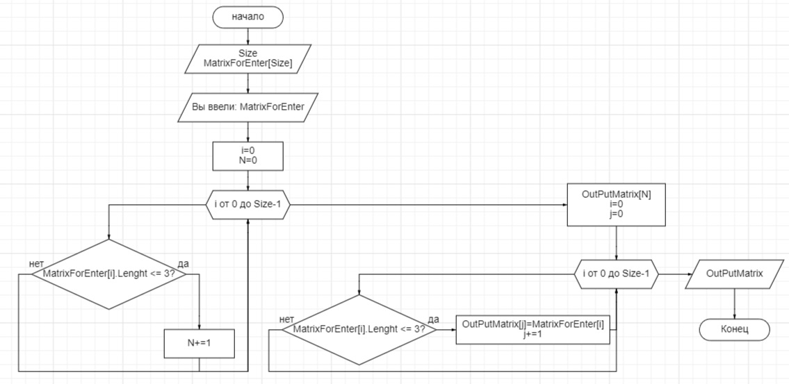

# Описание работы программы:
Программа, которая из имеющегося массива строк формирует новый массив из строк, длина которых меньше, либо равна 3 символам. Первоначальный массив можно ввести с клавиатуры.

Программа попросит пользователя ввести количество элементов числом. После этого предложит ввести с клавитуры элементы массива. Далее отобразит исходные элементы и элементы, имеющие до трёх символов включительно.

# Описание методов:
**Метод InputMatrix** - в рамках метода пользователю отправляется запрос на ввод размера массива и элементов массива. Данные записываются в массив, который возвращается по окончанию действия метода. Для ввода элементов используется цикл for, а массив string.

**Метод OutputMatrix** - принимает на вход массив из метода **InputMatrix** и возвращает массив с элементами, количество знаков которых меньше или равно трём. Метод работает в два цикла for. Первый цикл перебирает входной массив и высчитывает количество искомых элементов. Далее создаётся массив длинной в количество этих элементов, и второй цикл записывает их в данный массив. Возвращается массив string.

**Метод PrintMatrix** - печатает входящий массив. Метод оснащён циклом for, с условием на отбор последнего элемента. После вывода очередного элемента печатает ",", а после вывода последнего печатает ".". 

# Блок-схема алгоритма:
 

***Примечание:*** - блок-схема добавлена в папку проекта файлами jpg и json.